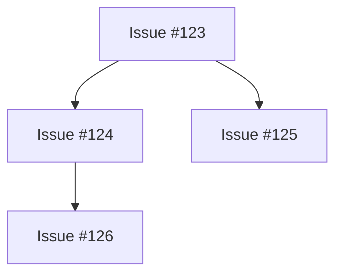

# Issue #96: MarkdownTransformer

## Description

Implement conversion of Graph Analysis results into GitHub-flavored Markdown (Tables and Mermaid diagrams). This enables rich formatting of Tasker analysis in GitHub comments.

## Requirements

- Create MarkdownTransformer service
- Convert Root Cause Analysis to Markdown table
- Convert Impact Analysis to Mermaid flowchart
- Format dependency chains as Mermaid graph
- Support GitHub-flavored markdown (tables, task lists, code blocks)
- Handle special characters and escaping
- Add image support for charts (upload to GitHub or use gist)

## Technical Details

### Transformer Functions
```python
class MarkdownTransformer:
    def transform_root_cause(analysis: RootCauseAnalysis) -> str: ...
    def transform_impact(analysis: ImpactAnalysis) -> str: ...
    def transform_dependencies(dependencies: list[UUID]) -> str: ...
```

### Output Examples

**Root Cause Table:**
```markdown
| Factor | Score | Details |
|--------|-------|---------|
| Component Match | 0.9 | auth-service → api-gateway |
| Temporal Recency | 0.7 | Modified 2 days ago |
```

**Impact Mermaid:**


## Business Value

Makes Tasker analysis readable and actionable in GitHub context. Human reviewers can understand complex graph analysis through visual formatting.

## Status: DONE